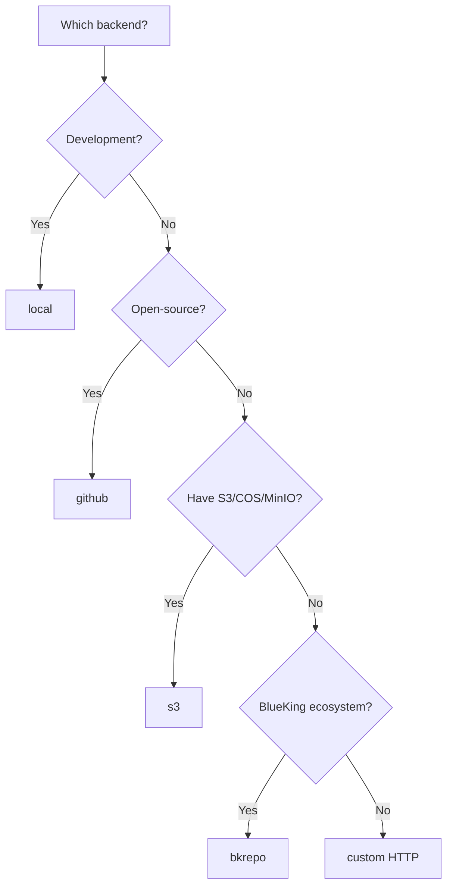

# Storage Backends

AgentVerse stores artifact **metadata** in PostgreSQL. Artifact **package archives** (zip files uploaded via `publish --zip`) are stored in a configurable object store.

## Supported Backends

| Backend | Key | Best For |
|---------|-----|----------|
| [Local Filesystem](/storage/local) | `local` | Development, E2E tests |
| [S3 / COS / MinIO / R2](/storage/s3-compatible) | `s3` | Production — most common |
| [GitHub Releases](/storage/github-releases) | `github` | Open-source projects |
| [Custom HTTP](/storage/custom) | `custom` | Internal org storage |
| [BK-Repo (蓝鲸)](/storage/bk-repo) | `bkrepo` | Tencent BlueKing ecosystem ⭐ Default |

## Configuration

The backend is set in `config/default.toml` under `[object_store]`:

```toml
[object_store]
backend = "bkrepo"   # bkrepo | local | s3 | github | custom
```

You can also override at runtime with the `OBJECT_STORE_BACKEND` environment variable.

## How It Works

1. User runs `agentverse publish --zip skill.zip`
2. CLI uploads the zip to `POST /api/v1/skills/:ns/:name/upload`
3. Server stores the archive in the configured backend
4. Server returns a **download URL** for the archive
5. URL is stored in the skill's package registry

Depending on the backend, the download URL may be:
- A public CDN URL (public bucket)
- A pre-signed URL with expiry (private S3 bucket)
- A GitHub Release asset URL
- A custom endpoint URL with embedded token

## Choosing a Backend



